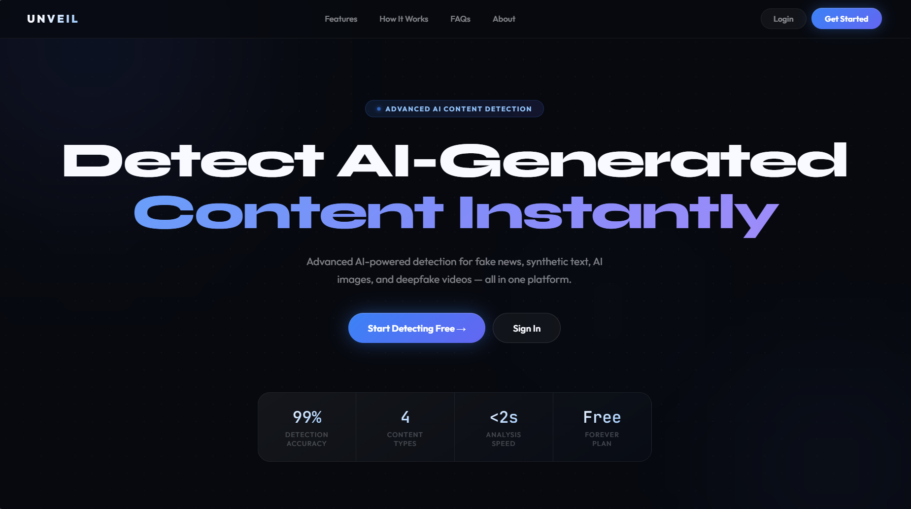
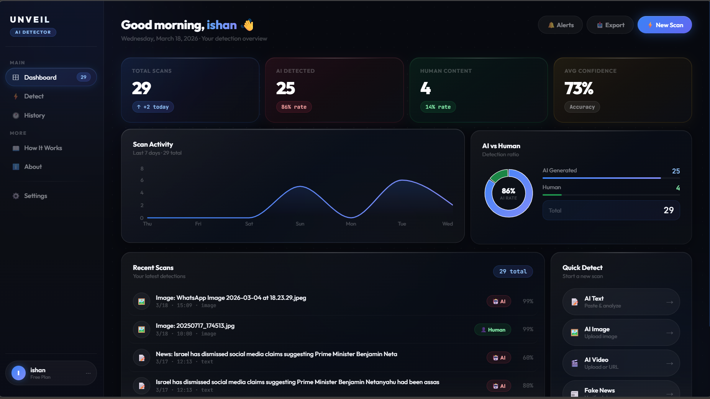
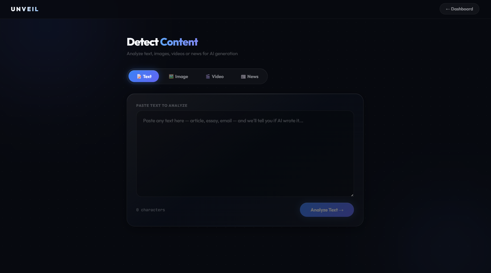

# 🔍 Unveil — AI Content Detection Platform

> Detect AI-generated text, images, videos, and fake news with confidence.

   

---

## 🚀 Live Demo

**[https://unveil-drab-chi.vercel.app](https://unveil-drab-chi.vercel.app)**

---

## 🖼️ Screenshots

### Landing Page


### Dashboard


### Detect Page


---

## ✨ Features

- 📝 **Text Detection** — Groq LLaMA 3.3 70B analyzes writing patterns with phrase-level highlighting
- 🖼️ **Image Detection** — Sightengine GenAI scoring + Groq vision explainability breakdown
- 🎬 **Video Detection** — Frame-by-frame analysis using ffmpeg + Groq vision (upload or URL)
- 📰 **Fake News Detection** — Google Fact Check API + AI credibility scoring
- 📊 **Dashboard** — Scan history, stats, area chart, AI vs Human donut chart
- 🧩 **Chrome Extension** — Right-click any text/image on any webpage to detect instantly
- 🔐 **Auth** — JWT-based signup/login with Supabase

---

## 🛠️ Tech Stack

| Layer | Technology |
|-------|-----------|
| Frontend | React + Vite + Tailwind CSS |
| Backend | Node.js + Express |
| Database & Auth | Supabase (PostgreSQL) |
| Text AI | Groq LLaMA 3.3 70B |
| Image AI | Sightengine + Groq LLaMA 4 Scout Vision |
| Video AI | ffmpeg frame extraction + Groq Vision |
| News AI | Google Fact Check API + Groq |
| Extension | Chrome MV3 |
| Deploy | Vercel (frontend) + Render (backend) |

---

## 📁 Project Structure

```
Unveil/
├── client/          # React + Vite frontend
│   └── src/
│       ├── pages/   # Landing, Login, Signup, Dashboard, Detect
│       ├── context/ # AuthContext
│       └── api/     # Axios instance
├── server/          # Node.js + Express backend
│   ├── controllers/ # detectController, authController
│   ├── routes/      # auth.js, detect.js
│   ├── middleware/  # JWT auth
│   └── config/      # Supabase client
└── extension/       # Chrome MV3 extension
```

---

## ⚙️ Setup & Installation

### Prerequisites
- Node.js v18+
- ffmpeg installed and added to PATH
- Supabase project
- Groq API key
- Sightengine account
- Google Fact Check API key

### 1. Clone the repo
```bash
git clone https://github.com/ishanpandey332/Unveil.git
cd Unveil
```

### 2. Setup Backend
```bash
cd server
npm install
```

Create `server/.env`:
```env
PORT=5000
SUPABASE_URL=your_supabase_url
SUPABASE_KEY=your_supabase_anon_key
GROQ_API_KEY=your_groq_key
SIGHTENGINE_USER=your_sightengine_user
SIGHTENGINE_SECRET=your_sightengine_secret
GOOGLE_FACT_CHECK_KEY=your_google_key
JWT_SECRET=your_jwt_secret
```

```bash
npm start
```

### 3. Setup Frontend
```bash
cd client
npm install
npm run dev
```

### 4. Supabase Database
Run in Supabase SQL editor:
```sql
create table profiles (
  id uuid references auth.users on delete cascade,
  name text, email text, created_at timestamp default now(),
  primary key (id)
);

create table scans (
  id uuid default gen_random_uuid() primary key,
  user_id uuid references profiles(id) on delete cascade,
  type text check (type in ('text', 'image', 'video')),
  input_preview text,
  result text check (result in ('ai', 'human')),
  confidence float,
  created_at timestamp default now()
);
```

### 5. Chrome Extension
1. Go to `chrome://extensions`
2. Enable **Developer Mode**
3. Click **Load unpacked** → select the `extension/` folder

---

## 👥 Team

Built by **Ishan Pandey** — B.Tech CSE, GL Bajaj Institute of Technology and Management

---

## 📄 License

MIT